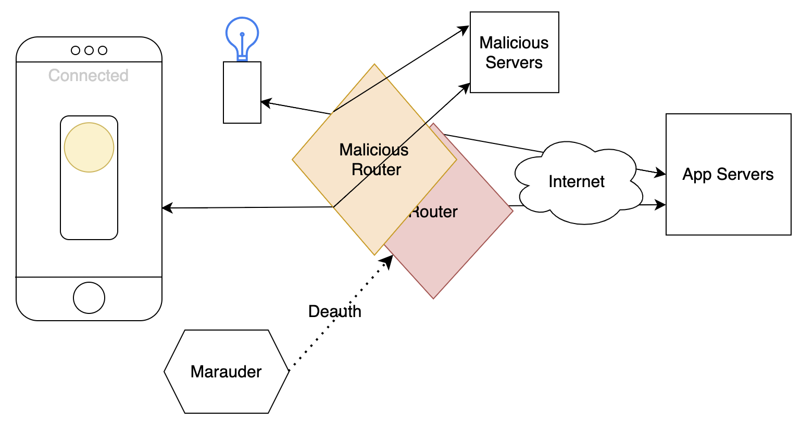

# Capture The Flag 
Attack surface, attack tooling, and patch included

<p align="center">

</p>

Directory
- [Project Directory](#project-directory) 
- [Quickstart](#quickstart)
- [Motivation](#motivation)
- [Resources](#resources)
- [References](#references)

## Project Directory
| Name                                     | Purpose                                                       | 
| :--                                      | :--                                                           |
|[attack](attack)                          | Resources for an attack on the IOT-light                      |
|[img](img)                                | Docs & diagrams                                               |
|[iot-lght](iot-light)                     | Firmware, Server, & UI for an IOT-light                       |

## Quickstart
- [Requirements](#requirements)
  - [Hardware](#hardware)
  - [Software](#software)
- [Setup](#setup---create-an-iot-light)
  - [Create an iot-lght](#setup---create-an-iot-light)
- [Attack](#attack)
  - [Create an ESP32Marauder](#attack-prep-part-12---create-an-esp32marauder)
  - [Create a mini wifi router](#attack-prep-part-22---create-a-mini-wifi-router)
  - [Launching an attack](#launching-an-attack)
- [Patch](#patch-for-the-attack)
### Requirements
#### Hardware
- [3 ESP32 dev boards](https://www.amazon.com/s?k=3+esp32+wrover), typically boards with an esp32 that has a cap with more detailed descriptions are higher quality,  3 for $15 is a good deal as of 2023
- [Micro usb cable](https://www.amazon.com/s?k=microusb)
- [Breadboard](https://www.amazon.com/s?k=breadboards)
- [Led's](https://www.amazon.com/s?k=leds+100+pieces+color)
- [Resistors](https://www.amazon.com/s?k=resistor+kit)

#### Software
- [VScode](https://code.visualstudio.com/Download)
- [PlatformIO vscode extension](https://platformio.org/install/ide?install=vscode)
- [Nodejs](https://nodejs.org/en)
- [This Repo](https://github.com/BarakBinyamin/ctf)
```
git clone <your fork URL> && cd ctf
```


### Setup - Create an IOT Light
The IOT-light, uses hardcoded credentials to connect to WiFi, check for updates and communications by connecting to a custom server, and if an update was available, will pull a new firmware from github.com or wherever the server tells it to
1. Wire up an LED to GPIO32(D32) and a ground pin
1. Open [iot-light/app](iot-light/app) a terminal 
2. From the cmd line run `node index.js` to launch the app server, the app should be available at [http://localhost](http://localhost), `http://<your ip address>`, and `http://<your hostname>`, scan the QR code to jump to the app on your phone if your on the same wifi as your laptop
3. Run the `hostname` command in a bash terminal to find the hostname of your computer
4. Open [iot-light/light](iot-light/light) in its own vscode window
5. Plug in an esp32 dev board
6. Create a config.h file with your wifi credentials and ip address, and add it to [iot-light/light/include/](iot-light/light/include/) 
```
#define SSID     "SSID"                           
#define PASS     "PASS"                        
#define WSSERVER "IP_ADDRESS_OR_HOSTNAME_OF_SERVER"   
#define WSPORT   80     
```
7. PlatformIO ->blue1->upload&monitor
8. Build all the other targets too, copy the firmware over to the releases folder and rename them `v<1-3>.bin`, name the red target firmware `red-firmware.bin`, this will be refrenced in the malicous server
9. If you're plaaning on using github to store you firmware to pull, change the base address to your github fork url in [iot-light/app/index.js](iot-light/app/index.js), if not you will need to use a [different root certificate in the patch](https://randomnerdtutorials.com/esp32-https-requests/)

### Attack
Getting full control of the IOT light
#### Overview
1. Use tools like [Fing](https://apps.apple.com/au/app/fing-network-scanner/id430921107) and [Wireshark](https://www.wireshark.org/download.html) to find the IOT-light connected to the wifi
2. Setup a malicous router with same wifi and ssid as the target, launch & connect [malicous servers](attack/servers) to it
3. Use the Maurauder to disconnect the **IOT-Light** so it will recconnect to the fake access point
4. Identify web requests from the IOT-light using network tools like `tcpdump` and wireshark
5. When a request to get the new firmware is made, the IOT-light will get the firmware provided by the malicous servers

#### Attack Prep Part 1/2 - Create an ESP32Marauder
1. Open the [ESP32Marauder](ESP32Marauder) folder in vscode, let platformio process
2. From the platformio menu, select upload
3. Connect to the **MarauderOTA** wifi, password is **justcallmekoko**
4. Go to [192.18.4.1](http://192.18.4.1)
5. Login with user **admin** password **admin**
6. Choose file -> [attack/ESP32Marauder/esp32_marauder_v0_13_3_20231114_old_hardware.bin](attack/ESP32Marauder/esp32_marauder_v0_13_3_20231114_old_hardware.bin), and select update
7. Wait like 60 seconds, a little after the 100% percent feedback is reached
8. Great! You made a marauder! Now you can connect over serial using the platformio monitor button, after a few confguartion messages the cli should pop up
```
CLI Ready
> 
              @@@@@@
              @@@@@@@@
              @@@@@@@@@@@
             @@@@@@  @@@@@@
          @@@@@@@      @@@@@@@
        @@@@@@            @@@@@@
     @@@@@@@                @@@@@@@
   @@@@@@                      @@@@@@
@@@@@@@              @@@@@@@@@@@@@@@@
@@@@@                 @@@@@@@@@@@@@@@
@@@@@                   @@@@@@@
@@@@@                      @@@@@@
@@@@@@                       @@@@@@@
  @@@@@@                        @@@@@@@@@@@@
    @@@@@@@                          @@@@@@
       @@@@@@                     @@@@@@
         @@@@@@@                @@@@@@
            @@@@@@           @@@@@@
              @@@@@@@      @@@@@@
                 @@@@@@ @@@@@@
                   @@@@@@@@@
                      @@@@@@
                        @@@@


--------------------------------

         ESP32 Marauder

            v0.13.4

       By: justcallmekoko

--------------------------------
>#
``` 
#### Attack Prep Part 2/2 - Create a mini wifi router
1. Open the esp32_nat_server folder in vscode, let platformio process, then press the upload button 
2. On another device you should see a wifi named **ESP32 NAT router**, connect
3. A router settings page should be available @ [http://192.168.4.1](http://192.168.4.1)

For reference, the following line in [attack/esp32_nat_router/main/esp32_nat_router.c](attack/esp32_nat_router/main/esp32_nat_router.c) has been changed so that the first device connnected is the default dns server if traffic is not being forwarded to another router
```c++
#define DEFAULT_DNS "192.168.4.2"
```

#### Launching an attack

##### Finding the target, analysing newtork requests
Options  
- Use [Fing](https://apps.apple.com/au/app/fing-network-scanner/id430921107) to identify devices on the same network
- Use the maurader to discconect the target from the wifi, host a router that will route dns requests to your computer, use a dns server to analze requests made from the target. 
- On a malicous router running linux, it is possible to view network traffic using `tcpdump`

##### Spoofing the **IOT-Light** 
1. `ls /dev/tty*` to find your usb connection to your mauraduer
2. `screen /dev/tty<USB1orSomething> 115200`, type `help` for a help menu to pop up
3. `scanap` with the marauder to save a list of access points
4. `stopscan` after you've seen the ssid the **IOT-light** is connected to
5. `list -a` to list the wifi ap's
6. `select -a -f "contains <unique substring of the ap to attack>"` to select the device(s) to fake death packets from so connected devices will switch to the fake access point (if its in range)
7. Power up the bad router with the wifi credentials of the ap to attack
8. Connect to it, the blue light will start blinking
9. Keep the screen terminal open, open two terminals in the main ctf directory
10. In one run ``cd attack/servers && npm install``, then `node attack/servers/dns-server.js`
11. In the other run `node attack/servers/bad-firmware.js`
12. In the screeen terminal `attack -t deauth`, but `attack -t probe` may also work, now hopefully the iot-light will connect to the bad router, all dns & http requests will be redirected to your machine, and you'll be able to replace the firmware when a request is made on the iot-ligh (when it starts flashing), watch the other two terminals for requests

##### Spoofing the **IOT-Light** 
1. Open 3 terminals in the main project directory
2. Download the malicicous servers local dependencies ``cd attack/servers && npm install``
3. Connect to the mauraduer with screen, `ls /dev/tty*` to find your usb connection to your mauraduer, then `screen /dev/tty<USB1orSomething> 115200`, type `help` for a help menu to pop up
4. `scanap` with the marauder to scan for access points, `stopscan` after you've seen the ssid the **IOT-light** is connected to
5. `list -a` to list the wifi ap's
6. `select -a <n,n,n>"` OR `select -a -f "contains <unique substring of the ap to attack>"`  to select the device(s) to fake death packets from so connected devices will switch to the fake access point (if its in range)
7. Power up the bad router with the wifi credentials of the ap to attack
8. Connect to it, the blue light will start blinking
9. Keep the screen terminal open, open two terminals in the main ctf directory
10. In another terminal run `node attack/servers/dns-server.js`
11. In the last terminal run `node attack/index.js`
12. In the screen terminal `attack -t deauth`, but `attack -t probe` may also work, now hopefully the iot-light will connect to the bad router, all dns & http requests will be redirected to your machine, and you'll be able to replace the firmware when a request is made on the iot-ligh (when it starts flashing), watch the other two terminals for requests

#### Patch for the attack
Updated browsers including Chrome and Safari, verify the authorship of a website’s certificate through the verification of its digital signature. An https website can either have a self signed certificate or a certificate signed by a certificate authority. Common browsers and advanced IOT devices have a list of various certificate authorities and their public keys, which can be used to decrypt a portion of a certificate with their signature. Only a certificate organization's private key can produce a signature that will be successfully unencrypted by a public key. In this way, the signature is verified, and the connections can be evaluated as secure or insecure.	

<p align="center">

<p align="center">Image Taken From <a src="https://www.thesslstore.com/blog/ssltls-certificate-its-architecture-process-interactions">Thesslstore</a></p>
</p>

The patched firmware that verifies authorship before pulling a new firmware image, is listed in [iot-light/light/src/main-patch.cpp](iot-light/light/src/main-patch.cpp), and can be built and uploaded with the options for the target labeled "patch". To do this open a vscode window in the [iot-light/light](iot-light/light) directory, platformio should automatically detect the platformio.ini file that is now at the top level of the file system in the window, after a few seconds, pressing the bug icon in the extension tabs should show the targets available. 

## Motivation
IOT devices are commonly built with certain hardware constraints, limiting them to use IP over wifi or some subset of wireless communication protocol like Zigbee or espnow to interact with each other

Wireless communication represents a greater hardware security risk than a wired connection. The that cost of attacks are reduced when physical access is extened to a larger range and physical techniques for wire tapping are not required  

[Hardware security threats](https://en.wikipedia.org/wiki/STRIDE_(security)) are all across the board, including 
- **Spoofing** ex. Malicious router broadcasting the same name/ssid as a trusted router
- **Tampering** ex. Man in the middle altering data
- **Information disclosure** ex. Man in the middle capturing data
- **Repudiation** ex. Malicious router can imitate authorship credentials
- **Denial of Service** ex. Deauth with udp packets or flooding wifi channel with noise
- **Elevation of Privilege** ex. Can’t think of one at the moment but there is probably one out there

[Here is a paper about this project](), [Here are some slides too]()

# Resources
- [Rui & Sarah Santos: ESP32 https requests](https://randomnerdtutorials.com/esp32-https-requests/)
- [QR code generator](https://www.the-qrcode-generator.com/)
- [Whats EAP](https://en.wikipedia.org/wiki/Extensible_Authentication_Protocol)
- [Fritzing arduino diagram tool]()
- [Wifi passwords are encryption keys](https://www.quora.com/What-prevents-people-from-harvesting-WiFi-passwords-by-setting-up-a-fake-access-point-with-the-same-SSID-as-their-target)

# References
- [Dr. Michael Zuzak](https://www.rit.edu/directory/mjzeec-michael-zuzak), _CMPE 361 Intro to Hardware Security Course_ & Advising, Contact For Resources
- [Long lam](https://www.linkedin.com/in/long-lam-5943281b1/), _Hardware Security Tutorials & Advising_, Contact For Resources
- [Thesslstore](https://www.thesslstore.com), _Signed Cert Image_, https://www.thesslstore.com/blog/ssltls-certificate-its-architecture-process-interactions  